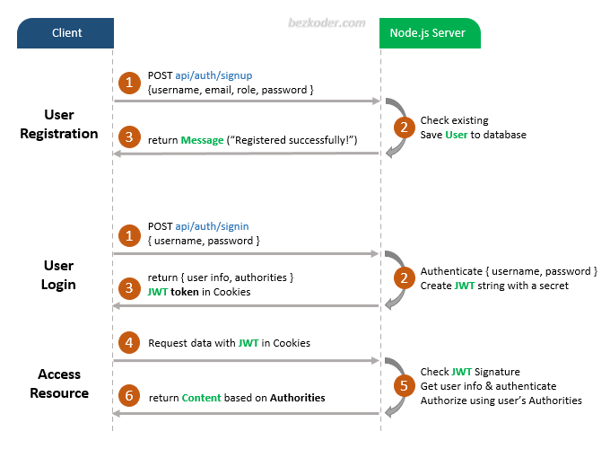

# Node.js Express Authentication with JWT

A comprehensive example of implementing **User Login and Registration** with **JWT (JSON Web Token)** in a **Node.js Express** application.

This project demonstrates:
- User registration, login, and access control with JWT authentication.
- Secure handling of user credentials using **bcrypt.js**.
- Database management with **Sequelize ORM** and **MySQL**.
- Middleware for authentication and role-based authorization.
- Express architecture with **CORS**, middleware, and database configuration.

---

## 🛠️ Project Overview

### User Registration and Authorization Flow

The following diagram outlines the complete process:



1. **User Registration**: Users provide their username, email, and password. Passwords are securely hashed and stored in the database.
2. **User Login**: Validates user credentials and generates a signed JWT token.
3. **Access Control**: Users access protected resources using the JWT token. Authorization checks enforce role-based permissions (e.g., Admin, Moderator, User).

---

## 📁 Project Structure

```
.
├── config/              # Configuration files (DB connection, JWT secret)
├── controllers/        # Business logic (signup, signin, etc.)
├── middleware/         # Authentication & Authorization logic
├── models/             # Sequelize models (User, Role, etc.)
├── routes/             # Express routes
├── server.js           # Entry point
└── package.json        # Project metadata and dependencies
```

---

## 🚀 Getting Started

### Prerequisites
Ensure you have the following installed:
- **Node.js** (v16.x or later)
- **MySQL** (or compatible database)
- **Postman** (optional, for testing API endpoints)

### Step 1: Clone the Repository
```bash
git clone <repository_url>
cd <project_directory>
```

### Step 2: Install Dependencies
```bash
npm install
```

### Step 3: Configure Environment
Modify the database and JWT settings in `config` folder:

**auth.config.js**
```js
module.exports = {
  secret: "your-secret-key",
};
```

**db.config.js**
```js
module.exports = {
  HOST: "localhost",
  USER: "root",
  PASSWORD: "your_password",
  DB: "testdb",
  dialect: "mysql",
  pool: {
    max: 5,
    min: 0,
    acquire: 30000,
    idle: 10000
  }
};
```

### Step 4: Set Up the Database
Ensure MySQL is running and create the database:

```sql
CREATE DATABASE testdb;
```

### Step 5: Run the Application
```bash
node server.js
```

The server will start at `http://localhost:8080` (or as configured).

---

## 🔍 API Endpoints

### Authentication Routes
| Method | Endpoint         | Description            |
|--------|------------------|------------------------|
| POST   | `/api/auth/signup` | Register a new user    |
| POST   | `/api/auth/signin` | Login and get JWT     |
| POST   | `/api/auth/signout`| Logout user (session) |

### Protected Routes (JWT Required)
| Method | Endpoint                | Role        | Description             |
|--------|-------------------------|-------------|-------------------------|
| GET    | `/api/test/all`         | Public      | Access public content   |
| GET    | `/api/test/user`        | User        | Access user content     |
| GET    | `/api/test/mod`         | Moderator   | Access moderator content|
| GET    | `/api/test/admin`       | Admin       | Access admin content    |

---

## 🧪 Testing the Application

1. **Register a User**
```bash
POST /api/auth/signup
{
  "username": "testuser",
  "email": "test@example.com",
  "password": "password123",
  "roles": ["user"]
}
```

2. **Login and Retrieve JWT**
```bash
POST /api/auth/signin
{
  "username": "testuser",
  "password": "password123"
}
```

Copy the `accessToken` from the response.

3. **Access Protected Routes**
Add the JWT token to the `Authorization` header:

```
Authorization: Bearer <your_token>
```

Example request to the admin board:
```bash
GET /api/test/admin
```

---

## 📌 Additional Features

- **Role-based Authorization**: Secure endpoints based on user roles (User, Admin, Moderator).
- **Session Management**: JWT token stored in session cookies.
- **Input Validation**: Ensure uniqueness of username and email.

---

## 📚 Resources
- [Node.js Documentation](https://nodejs.org/)
- [Express.js Documentation](https://expressjs.com/)
- [Sequelize ORM](https://sequelize.org/)
- [JWT (jsonwebtoken)](https://www.npmjs.com/package/jsonwebtoken)

---

## 🏗️ Future Improvements
- Implement password reset and email verification.
- Enhance input validation using **Joi** or **Express-validator**.
- Optimize database queries and add rate-limiting for security.

---

## 📜 License
This project is licensed under the **MIT License**.

---

## 📧 Support
For issues and contributions, open a pull request or contact the repository maintainer.

Happy coding! 🚀

